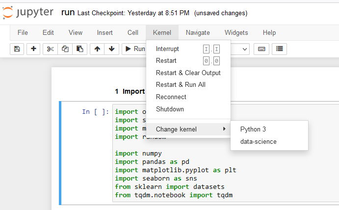

## Jupyter installation for the environment [ Optional ]

Installation can be done ```pip install Jupyter```. However big list dependency of Jupyter can be avoided by installting ipython kernel module only, if you have Jupyter installed Globally.

1. ```pip install ipykernel```
2. ```python -m ipykernel install --user --name=<promt>```
3. You should now be able to see your kernel in the IPython notebook menu: Kernel -> Change kernel

    

4. To Remove the kernel 
    - ```jupyter kernelspec list``` this list down all installed kernal.
    - ```jupyter kernelspec uninstall <unwanted-kernel>``` removes the kernal.  