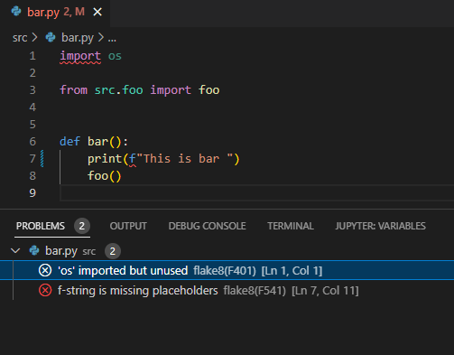
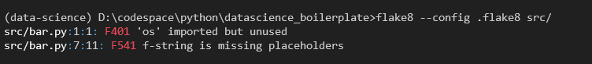
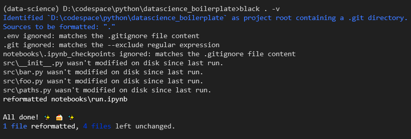

## Linting [ using flake8 ]

1. Linting error from VS-CODE editor

    

2. Run linting form cmd using  ```flake8 --config .flake8 src/ tests/ -v or  flake8 -v .```

    

3. Disable linting for a specific line, example
    ```
        import config.logging_settings # noqa <Error No>
    OR 
        global VAR # noqa <Error No>
    ```
4. Awsome Flake-8 [Plugin](https://github.com/DmytroLitvinov/awesome-flake8-extensions#all-in-one) list


## Cleaning the cache files [ using pyclean ]

Run ``` pyclean src/ tests/ -v```

## Code Formating [ using balck ]

Run ```black . -v```



